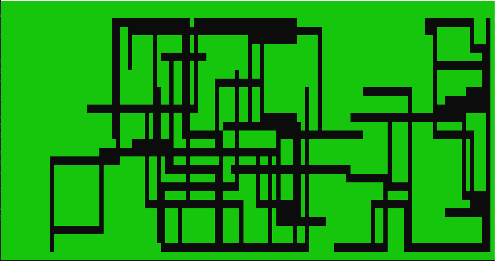

# Random Walk Map Generator

# Overview

## Description

This is the second procedural generation project I have been exploring, the first
is the **Cellular Automata Cave Generator** project.

This is a simple Console Application that generates a random *Dungeon-Like* Map
using the **Random Walk Algorithm**. This application is focused on the generation
of the map so simply prints the generated map to the Console. The aim is to use
the `RandomWalkMap` Class for projects later on. Below is an example of the output
from this application:

This method of generating maps differs from the **Cellular Automata Cave Generator**
in a few ways:

  * This method will produce a map that every section is **always** accessible.
  * It will produce a more artificial *'Manmade'* look to it as there are tunnels
    and right angles.
  * It might produce small clustered maps instead of filling the whole console.

This method of map generation does have some limitations. These will be explored
in a later section.
