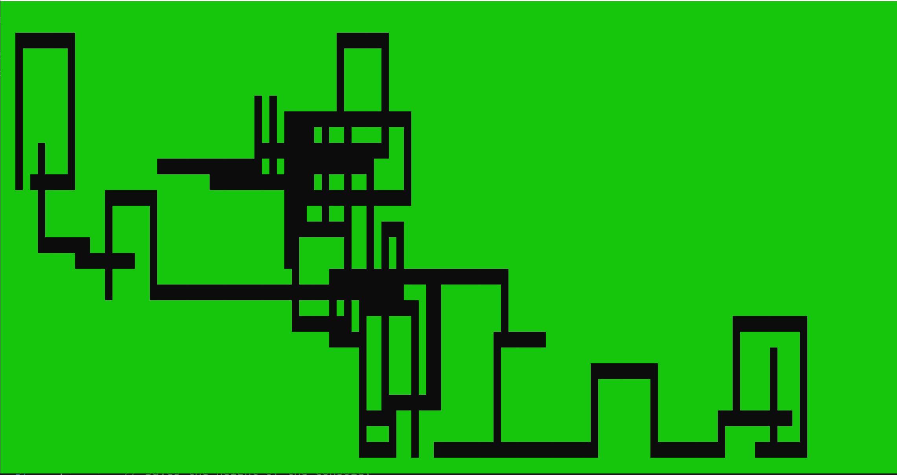

# Random Walk Map Generator

# Overview

## Description

This is the second procedural generation project I have been exploring, the first
is the **Cellular Automata Cave Generator** project.

This is a simple Console Application that generates a random *Dungeon-Like* Map
using the **Random Walk Algorithm**. This application is focused on the generation
of the map so simply prints the generated map to the Console. The aim is to use
the `RandomWalkMap` Class for projects later on. Below is an example of the output
from this application:


This method of generating maps differs from the **Cellular Automata Cave Generator**
in a few ways:

  * This method will produce a map that every section is **always** accessible.
  * It will produce a more artificial *'Man-made'* look to it as there are tunnels
    and right angles.
  * It might produce small clustered maps instead of filling the whole console.

This method of map generation does have some limitations. These will be explored
in a later section.

## How Does it work?

The **Random Walk Algorithm** is one of the simplest ways of producing a *Dungeon-Like*
map. It produces by following the below steps:

  1. Make a *2D bool array* and set all values to `true`.
  2. Choose a random starting point on the map.
  3. While the number of **Required Tunnels** is not **0**.
  4. Choose a random length for **Tunnel Length**.
  5. Choose a random direction to travel (**Up**, **Down**, **Left**, **Right**).
  6. Draws a tunnel in the selected direction while avoiding the map edge.
  7. Decrement the number of **Required Tunnels** to, then repeat *While Loop*.
  8. *Loop* will continue until the **Required Tunnels** reaches 0.

# `RandomWalkMap` Class

## Description

The `RandomWalkMap` Class is responsible for the procedural generation of the *Dungeon*
map. It also has a number of properties that can be used to tweak the procedurally
generated output.

## Properties

`WallCharacter` - Sets the character that prints as Walls. (Default █)

`WallColor` - Sets the Wall Color. (Default is `ConsoleColor.Green`)

`DefaultColor` - Sets the default console color. (Default is `ConsoleColor.Gray`)

`TunnelsRequired` - Sets the number of tiles required to be generated. (Default is **150**)

`MaxTunnelLength` - Sets the maximum length a generated tunnel can be. (Default is **10**)

## Private Variables

`consoleWidth` - Set using `Console.WindowWidth`.

`consoleHeight` - Set using `Console.WindowHeight`.

## Classes

`Random` - Using the native `Random` Class. Its used to generate random numbers.

## Methods

### Public Methods

#### GenerateRectangleMap

This method generates a new random rectangle type map. It then prints the map to
the console.

The `GenerateRectangleMap` methods is shown below:
```C#
public void GenerateRectangleMap()
{
    bool[,] map = generateMap();

    printMap(map);       
}
```

#### GenerateNaturalMap

This method generates a new random natural type map. It has an additional *Smoothing*
step to the rectangular map which rounds the edges to make a more natural looking
map.

The `GenerateNaturalMap` methods is shown below:
```C#
public void GenerateNaturalMap()
{
    bool[,] map = generateMap();

    // TO DO: Implement 'smoothing' step to make map more natural
    smoothMap(map);

    printMap(map);
}
```

### Private Methods

#### initializeMap

This method initializes the map full of walls. This is the starting point for the
map generation. An image of the an initial map is below:


The `initializeMap` method is shown below:
```C#
private bool[,] initializeMap()
        {
            bool[,] initialMap = new bool[consoleWitdth, consoleHeight];

            for (int x = 0; x < consoleWitdth; x++)
            {
                for (int y = 0; y < consoleHeight; y++)
                {
                    initialMap[x, y] = true;
                }
            }

            return initialMap;
        }
```

#### randomStartPosition

This method returns a random initial start position.

The `randomStatPosition` method is shown below:
```C#
private int[,] randomStartPosition()
        {
            int[,] startPosition = new int[2,1];

            startPosition[0,0] = randomNumber.Next(2, (consoleWitdth - 2));
            startPosition[1,0] = randomNumber.Next(2, (consoleHeight - 2));

            return startPosition;
        }
```

#### chooseRandomDirection

This method is used to select the random direction of travel to generate the tunnel.
It does this by returning a pair of values that can be added to the current position
to move in one of four directions (Up, Down, Left and Right). To move the directions
the below pairs of values are returned:

  * Up -    [0, -1].
  * Down -  [0, 1].
  * Left -  [-1, 0].
  * Right - [1, 0].

The direction is then returned using the `Random` Class.

The `chooseRandomDirection` method is shown below:
```C#
private int[,] chooseRandomDirection()
        {
            int[][,] direction = {
                new int[,] { { 0 }, { -1 } },  // Up
                new int[,] { { 0 }, { 1 } },   // Down
                new int[,] { { -1 }, { 0 } },  // Left
                new int[,] { { 1 }, { 0 } }    // Right
            };

            return direction[randomNumber.Next(0, direction.Length)];
        }
```

#### makeTunnel

This method creates a tunnel in a random direction, this direction is selected with
`chooseRandomDirection` method. The tunnel is created a random length in the selected
direction. The can be any value between 1 and `MaxTunnelLength` cells long.

This method will check that each `newPosition` is within the valid Console area
this is checked with the `isValid` method. If a `newPosition` value is outside the
valid Console area then the tunnel creation is stopped.

The `newPosition` is determined by adding the `direction` (attained by
`chooseRandomDirection` method) to the `currentPosition`. The tunnel will continue
to build in the same direction until it is completed or it reaches the edge of the
valid Console area.

The `makeTunnel` method is shown below:
```C#
private int[,] makeTunnel(bool[,] map, int[,] currentPosition)
        {
            int[,] direction = chooseRandomDirection();
            int[,] endPosition = currentPosition;
            int randomTunnelLength = randomNumber.Next(1, MaxTunnelLength);

            for (int tunnelCell = 0; tunnelCell < randomTunnelLength; tunnelCell++)
            {
                int[,] newPosition = { { currentPosition[0, 0] + direction[0, 0] }, { currentPosition[1, 0] + direction[1, 0] } };

                if (isValid(map, newPosition))
                {
                    setEmpty(map, newPosition[0, 0], newPosition[1, 0]);

                    endPosition[0, 0] += direction[0, 0];
                    endPosition[1, 0] += direction[1, 0];
                }
            }

            return endPosition;
        }
```

#### isValid

This method takes in a position and a map. It will return a bool confirming if the
position is inside the valid Console area (`true` position is within valid Console
area, `false` position is outside the valid Console area). By default the valid
Console area has a border of unusable cells around the edge of the Console area
of 2 cells. Below the valid Console area is shown below in black, while unusable
cells are show in green:


The `isValid` method is shown below:
```C#
private bool isValid(bool[,] map, int[,] position)
        {
            bool valid = false;

            if(position[0,0] >= 2 && position[0,0] <= (consoleWitdth - 2))
            {
                if (position[1,0] >= 2 && position[1,0] <= (consoleHeight - 2))
                {
                    valid = true;
                }
            }

            return valid;
        }
```

#### setEmpty

This method sets the cell at position `xposition`, `yPosition` inside the 2D bool
array `map` to `false`.

The `setEmpty` method is shown below:
```C#
private void setEmpty(bool[,] map, int xPosition, int yPosition)
        {
            map[xPosition, yPosition] = false;
        }
```

#### generateMap

This method returns a 2D bool array that represents a map. This method essentially
returns a Rectangular Type map without any modifications or checks applied.

The `generateMap` method is shown below:
```C#
private bool[,] generateMap()
        {
            bool[,] map = initializeMap();

            int[,] startPosition = randomStartPosition();
            int[,] currentPosition = { { startPosition[0, 0] }, { startPosition[1, 0] } };

            setEmpty(map, startPosition[0, 0], startPosition[1, 0]);

            for (int tunnel = 0; tunnel < TunnelsRequired; tunnel++)
            {
                currentPosition = makeTunnel(map, currentPosition);
            }

            return map;
        }
```

#### smoothMap

This method takes the Rectangular Type map output from the `generateMap` method and
applies *'smoothing'* to the map to make it appear more natural and rounded.

**TODO: Insert image of smoothed map vs normal**

The `smoothMap` method is shown below:
```C#
private void smoothMap(bool[,] map)
{
    //TO DO: Implement this...
}
```

#### printMap

This method prints a map (represented as a 2D bool array) and prints it to the
console. It initially clears the Console using the `Console.Clear()` method. It
then prints the map, `true` values in the `map` array are represented using the
`WallCharacter` and will be printed in the `WallColor`.

The `printMap` method is shown below:
```C#
private void printMap(bool[,] map)
        {
            Console.Clear();

            Console.ForegroundColor = WallColor;

            for (int x = 0; x < map.GetLength(0); x++)
            {
                for (int y = 0; y < map.GetLength(1); y++)
                {
                    if (map[x,y])
                    {
                        Console.SetCursorPosition(x, y);
                        Console.Write(WallCharacter);
                    }
                }
            }

            Console.ForegroundColor = DefaultColor;
        }    
```

# Spawning Options

The following sections explores how each of the properties `TunnelsRequired` and
`MaxTunnelLength` affect the maps produced. This is helpful to understand when
tweaking the map to create the type of map required.

## Rectangle Type Map

This section outlines the affect modifying the properties changes Rectangle Type
map generation.

### TunnelsRequired

Below shows a map generated with a **Low** `TunnelsRequired` (**10** tunnels in this example):


Below shows a map generated with a **High** `TunnelsRequired` (**500** tunnels in this example):


Below shows a map generated with a **Default** `TunnelsRequired` (**150** tunnels in this example):


### MaxTunnelLength

Below shows a map generated with a **Low** `MaxTunnelLength` (**3** cells long in this example):


Below shows a map generated with a **High** `MaxTunnelLength` (**25** cells long in this example):


Below shows a map generated with a **Default** `MaxTunnelLength` (**10** cells long in this example):



## Natural Type Map

### TunnelsRequired

**TO DO: Add images and section once Implemented**

### MaxTunnelLength

**TO DO: Add images and section once Implement**

# Limitations / Issues

There are a few issues with this type of completely random map generation. It can
lead to some unpredictable results. The two most common unwanted results are shown
in the below sections.

## All Tunnels In Map Corner

One of the most common issues it that because tunnel direction is selected randomly
and tunnels cannot be made *Out of Bounds* sometimes all the created tunnels are
formed in one corner of the map. Please see below image for an example of this
issue:


## Clustered Tunnels

Another common issue with this type of map generation is that all of the tunnels
can be clustered together to form open voids instead of tunnels. This can lead to
some interesting maps but it can also lead to very clustered looking maps. See
the below image as an example of a *Clustered* map:


## Map Spread

Because the generated maps are so unpredictable the level of spread can vary. Maps
with larger spread tend to be the more appealing *Dungeon-Like* maps as opposed
to maps with low spread.

Below is a map with **High** spread:


Below is a map with **Low** spread:


